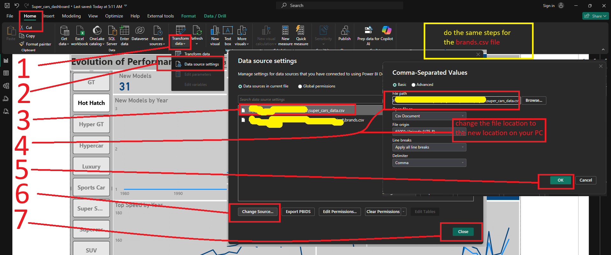

# Evolution of Performance Cars

## Table of Contents

- [Introduction](#introduction)
- [Repository Structure](#repository-structure)
- [How to Reproduce](#how-to-reproduce)
- [Data Resources](#data-resources)
- [Data Modeling and Cleaning](#data-modeling-and-cleaning)
- [Approach of the Analysis](#approach-of-the-analysis)
- [Findings](#findings)
- [Key Insights](#key-insights)
- [Limitations](#limitations)
- [Conclusion](#conclusion)

---

## Introduction

- The performance cars space has seen several changes across time due to advancements in the car-related fields, aero-space, metallurgy, electrical engineering, etc...
- Also, as the political conditions, environmental regulations, the needs and demands of the customers themselves change over time, the car industry in general tries to follow and meet these demands.
- That might not be to the liking of the pur car enthusiasts, for example, following the tightly restrictive emission regulations has played a vital role in downsizing engine sizes, but at the same time has pushed the industry to build more efficient engines, and explore more ways to increase power. That comes at the cost of car price, making it less accessible for the average income enthusiast.
- The demands of the customers for more SUVs, and more in general, played a role in changing the manufacturers' plans on how their portfolio should be.

We will examine how the performance segment has changed over time as a response of the external factors.

---

## Repository Structure

```
├── scraping_performance_cars.ipynb   # Scrapes car specs from SupercarWorld → 8 domain CSV files + brands.csv (v1)
├── scraping_brands.py                # Re-crawls brand catalog for high-res logos → brands_2.csv (merged into brands.csv)
├── Data_cleaning.ipynb               # Consolidates & cleans all CSV files → super_cars_data.csv + final brands.csv
├── super_cars_data.csv               # Primary data source — 1,100+ cars, 57 columns
├── brands.csv                        # Brand metadata — names, logos, flags, country, foundation year
├── Performance_cars_dashboard.pbix   # Power BI file — data model, DAX measures, and dashboard visuals
├── Data Modeling Docs.md             # Full technical documentation — pipeline, Power Query, model, relationships, measures
├── Evolution of Performance Cars Report.MD  # This file — project report and findings
└── change_location.png                       # Guide image — how to redirect data sources in Power BI Desktop
```

---

## How to Reproduce

**Prerequisites:** Python 3.x, Power BI Desktop

**1. Install dependencies**
```bash
pip install requests selectolax pandas numpy tqdm lxml
```

**2. Scrape car data**

Run `scraping_performance_cars.ipynb` in full. This scrapes SupercarWorld and outputs 8 domain-specific CSV files alongside an initial `brands.csv`.

**3. Scrape high-resolution brand logos**
```bash
python scraping_brands.py
```
This produces `brands_2.csv`. Manually merge it with the existing `brands.csv` — using the `Logo` column from `brands_2.csv` as the primary source, back-filled from `brands.csv` for any gaps — then delete `brands_2.csv`.

**4. Clean and consolidate**

Run `Data_cleaning.ipynb` in full. This merges all car CSV files into `super_cars_data.csv`, injects the `Brand ID` foreign key, and deletes the intermediate domain CSV files.

**5. Open the dashboard**

Open `Performance_cars_dashboard.pbix` in Power BI Desktop. Since the data sources are linked to the original machine's file paths, you will need to redirect them to your local copies of `super_cars_data.csv` and `brands.csv`. Follow these steps:

1. In the **Home** ribbon, click **Transform data → Data source settings**.
2. In the Data source settings dialog, select the `super_cars_data.csv` entry.
3. Click **Change Source...** at the bottom of the dialog.
4. In the file path field, click **Browse...** and navigate to wherever you saved `super_cars_data.csv` on your machine. Click **OK**.
5. Back in the Data source settings dialog, select the `brands.csv` entry and repeat the same steps to redirect it to your local `brands.csv`.
6. Click **Close**, then click **Refresh** to reload the data from the new paths.



> For full detail on the data model, Power Query steps, relationships, and DAX measures, see [Data Modeling Docs.md](Data%20Modeling%20Docs.md).

---

## Data Resources

The dashboard is powered by two CSV files produced by a Python scraping and cleaning pipeline. For full technical detail on how these files were built, refer to [Data Modeling Docs.md](Data%20Modeling%20Docs.md).

**`super_cars_data.csv`**
- Source: [SupercarWorld](https://www.supercarworld.com/cgi-bin/index.cgi)
- Scripts: `scraping_performance_cars.ipynb`, `Data_cleaning.ipynb`
- Contains specifications for over 1,100 production supercars across 57 columns — covering identity, production dates, pricing, engine specs, performance figures, and subjective ratings.

**`brands.csv`**
- Sources: [SupercarWorld](https://www.supercarworld.com/cgi-bin/index.cgi), [Car Logos](https://www.carlogos.org/), AI-assisted internet search
- Scripts: `scraping_performance_cars.ipynb`, `scraping_brands.py`
- Contains Brand ID, brand name, logo URL (high-resolution where available), country flag URL, country of origin, and brand foundation year. Logo URLs were consolidated from both sources — prioritising high-resolution assets from Car Logos — and foundation years were filled via AI search.

---

## Data Modeling and Cleaning

The data went through three sequential phases before the dashboard visuals were built:

1. **Python — Acquisition & Initial Cleaning:** Raw data was scraped from SupercarWorld, split across 8 domain-specific CSV files, and then consolidated into `super_cars_data.csv`. A `Brand ID` foreign key was added to link each car to its brand in `brands.csv`. Structural artefacts from scraping, concept car rows, and string-encoded numerics were cleaned at this stage.

2. **Power Query (M) — Deep Cleaning:** A second, more granular cleaning pass was applied inside Power BI Desktop — covering null handling, unit-suffix stripping, price parsing, production date splitting, rating score extraction, and power/torque column splitting.

3. **Power BI — Data Model & Presentation:** A star schema was built around a central fact table (`_ Fact_Cars`), with six dimension tables, a transmission bridge table for many-to-many resolution, a Date table, and 16 DAX measures. The dashboard visuals were assembled on top of this model.

For full technical detail on every step, refer to [Data Modeling Docs.md](Data%20Modeling%20Docs.md).

---

## Approach of the Analysis

- Created a Power BI dashboard that gives a peak into the time to see the main characteristics of the performance cars sub-categories and their main characteristics, and their perception of car enthusiasts and experts.

- Identify the different periods of new model releases of performance cars.
- Investigate the new models released, Performance in each period.
- Assess how the top 5 classes (by the number of models) changed throughout the different periods.

---

## Findings

### Overall Models by Class

Across the full production period from 1953 to 2025, the dataset encompasses 11 distinct vehicle classes, revealing a clear hierarchy in terms of model output.

The **Supercar** and **Track Focused** categories lead the field by a significant margin, with 211 and 203 models produced respectively, together accounting for the dominant portion of the entire segment by having over 41% of the total models. Following closely are the **GT**, **Sports Car**, and **Hypercar** categories with 128, 123, and 121 models each.

The **Super Saloon** and **SUV** categories with 68 and 40 models respectively, while **Hot Hatch** (31) and **Luxury** (29) trail slightly behind.

Finally, **Trackonly** accounts for 25 models, and **Hyper GT** — the most exclusive and narrowly defined category — rounds out the list with just 15 models produced over the entire period.

---

### New Model Trends by Period

#### Period 1 — Foundational Period (1953–1970)

**New Models — 41 models total**

| Class | Models | Share |
|---|---|---|
| GT | 12 | 29.3% |
| Sports Car | 12 | 29.3% |
| Supercar | 11 | 26.8% |
| Track Focused | 6 | 14.6% |

New model output during this period remained at a consistently minimal level, with annual volumes never exceeding 5 units. Production was recorded at 3 models in 1953 before contracting to a single model per year across most of the late 1950s. A gradual recovery followed, with output stabilizing at 3–5 models annually by the close of the 1960s. This phase reflects the nascent stage of the performance model segment, characterized by limited capacity and constrained market demand.

**Performance (Median):** 320.0 bhp · 288.5 lb/ft · 160.0 mph · 6.3s 0-60 · 240 in³ · 252 bhp/ton

Median BHP and torque during this period were highly variable, reflecting the limited number of models released annually and the diversity of engineering approaches characteristic of the era. Median BHP ranged between 170 (1953) and 380 (1965), while median torque fluctuated between 188 lb-ft (1964) and 490 lb-ft (1970). No consistent directional trend is discernible; figures were driven primarily by individual model specifications rather than any market-wide convergence in powertrain output.

Median top speed during this period ranged between 140 mph (1953) and 175 mph (1955), with no sustained directional trend. Annual variation was largely a function of model mix, and figures broadly reflected the aerodynamic and mechanical constraints inherent to the engineering standards of the era.

**Ratings (Median):** Desire 8.0 · Money 0.6 · Quality 7.0 · Bargain 0.2 · Looks 8.0 · Sound 9.0 · Overall 6.0

---

#### Period 2 — Early Volatility (1971–1984)

**New Models — 45 models total**

| Class | Models | Share |
|---|---|---|
| Supercar | 16 | 35.6% |
| Sports Car | 13 | 28.9% |
| GT | 6 | 13.3% |
| Hypercar | 4 | 8.9% |
| Track Focused | 3 | 6.7% |
| Hot Hatch | 1 | 2.2% |
| Luxury | 1 | 2.2% |
| Trackonly | 1 | 2.2% |

This period opened with a brief uptick to 7 models in 1971, followed by a sustained contraction through the late 1970s and into the early 1980s, reaching a cyclical low of just 1 model in 1981. A progressive recovery then ensued, culminating in 8 models by 1984 — the first meaningful inflection point signaling a structural shift toward expansion.

**Performance (Median):** 310.0 bhp · 294.5 lb/ft · 158.5 mph · 6.0s 0-60 · 240 in³ · 219 bhp/ton

This phase exhibited pronounced year-on-year swings in both metrics. Median BHP peaked at 580 in 1972 and again at 496.5 in 1979, before contracting sharply to 156 in 1981 — the lowest value recorded across the entire dataset. Median torque followed a similar pattern, reaching 502.5 lb-ft in 1977 and 461 lb-ft in 1979, before falling to 153 lb-ft in 1981. The severe compression of both indicators in the early 1980s is consistent with the combined effect of macroeconomic headwinds and tightening emissions regulations that materially constrained powertrain output during the period.

Top speed figures were similarly erratic across this phase. A notable high of 185 mph was recorded in 1977, while the period reached its lowest point at 130 mph in 1981 — the weakest median top speed in the entire dataset. The 1980–1981 contraction in top speed mirrors the concurrent collapse in BHP and torque, confirming a broad and uniform suppression of performance outputs during those years.

**Ratings (Median):** Desire 8.0 · Money 0.6 · Quality 7.0 · Bargain 0.5 · Looks 8.0 · Sound 8.0 · Overall 6.3

---

#### Period 3 — Growth Acceleration (1985–1999)

**New Models — 138 models total**

| Class | Models | Share |
|---|---|---|
| Supercar | 42 | 30.4% |
| Sports Car | 25 | 18.1% |
| Hypercar | 21 | 15.2% |
| Track Focused | 17 | 12.3% |
| GT | 14 | 10.1% |
| Super Saloon | 10 | 7.2% |
| Luxury | 3 | 2.2% |
| Hot Hatch | 2 | 1.4% |
| SUV | 2 | 1.4% |
| Trackonly | 2 | 1.4% |

Output scaled steadily, if unevenly, throughout this phase. Notable step-changes occurred in 1986 (9 models) and again in 1990 and 1992, where production reached 13 models in both years — representing a near-tripling from the early-decade baseline. Despite intermittent pullbacks, the upward trend held, with volumes reaching 18 models in 1999. This phase marks the segment's transition from niche to mainstream relevance.

**Performance (Median):** 352.5 bhp · 350.0 lb/ft · 170.0 mph · 4.7s 0-60 · 220 in³ · 267 bhp/ton

A more structured, if uneven, upward trend in both metrics emerged across this phase. Median BHP progressed from 350 in 1985 to a local high of 420 in 1996, while median torque rose from 296 lb-ft to 430 lb-ft by 1998. Intermittent pullbacks — most notably in 1986 (255 BHP, 248 lb-ft torque) and 1989 (230 BHP, 215 lb-ft torque) — did not materially disrupt the broader growth trajectory. This period reflects the industry's progressive and sustained investment in high-performance powertrain development.

Median top speed entered a more defined upward channel during this phase. From 159 mph in 1985, figures progressed to a local peak of 181.5 mph in 1995 and 181 mph in 1998, before moderating to 158 mph in 1999. The overall trajectory reflects the aerodynamic and powertrain advances being systematically deployed across the segment, even if year-on-year progression remained uneven.

**Ratings (Median):** Desire 7.0 · Money 0.7 · Quality 8.0 · Bargain 0.6 · Looks 8.0 · Sound 8.0 · Overall 6.6

---

#### Period 4 — Rapid Expansion (2000–2005)

**New Models — 164 models total**

| Class | Models | Share |
|---|---|---|
| Track Focused | 39 | 23.8% |
| Supercar | 36 | 22.0% |
| GT | 22 | 13.4% |
| Sports Car | 22 | 13.4% |
| Hypercar | 16 | 9.8% |
| Super Saloon | 14 | 8.5% |
| Hot Hatch | 7 | 4.3% |
| SUV | 4 | 2.4% |
| Luxury | 3 | 1.8% |
| Trackonly | 1 | 0.6% |

The period from 2000 to 2005 represents the most aggressive growth phase in the dataset up to that point. With a floor of 16 models in 2000, output accelerated sharply — rising to 21 in 2002, 27 in 2003, and 36 in 2004 — before reaching a then-record high of 46 models in 2005. This trajectory indicates a period of significant market expansion and heightened competitive activity across the performance segment.

**Performance (Median):** 405.0 bhp · 376.0 lb/ft · 173.0 mph · 4.3s 0-60 · 259 in³ · 293.5 bhp/ton

Both metrics advanced steadily in parallel with the surge in new model volumes. Median BHP rose from 367.5 in 2000 to 447 in 2005, while median torque increased from 324.5 lb-ft to 420 lb-ft over the same period. The pace of improvement, while meaningful, was measured relative to the sharp acceleration in release volumes, indicating that performance gains during this phase were achieved through incremental engineering progress rather than step-change breakthroughs.

Median top speed held within a relatively stable band of 160–175 mph throughout this phase, broadly consistent with the preceding period. The absence of a pronounced step-change in top speed — despite the significant surge in new model volumes — suggests that the expansion during this phase was driven by breadth of market offering rather than outright performance leadership at the top end.

**Ratings (Median):** Desire 7.0 · Money 0.7 · Quality 8.0 · Bargain 0.6 · Looks 8.0 · Sound 8.0 · Overall 6.8

---

#### Period 5 — Post-Peak Correction (2006–2011)

**New Models — 153 models total**

| Class | Models | Share |
|---|---|---|
| Supercar | 34 | 22.2% |
| Track Focused | 27 | 17.6% |
| GT | 20 | 13.1% |
| Hypercar | 19 | 12.4% |
| Sports Car | 16 | 10.5% |
| Super Saloon | 14 | 9.2% |
| Luxury | 8 | 5.2% |
| Hot Hatch | 7 | 4.6% |
| SUV | 5 | 3.3% |
| Trackonly | 3 | 2.0% |

Following the 2005 peak, new model volumes entered a clear and sustained contraction. Output declined from 31 in 2006 to 30 in 2007 and 24 in 2008. A partial recovery to 28 in 2009 proved short-lived, with volumes receding further to 21 in 2010 and 19 in 2011 — the lowest level recorded since the early 2000s. This phase likely reflects the broader macroeconomic headwinds of the period, including the impact of the global financial crisis on discretionary automotive segments.

**Performance (Median):** 514.0 bhp · 461.0 lb/ft · 189.0 mph · 3.8s 0-60 · 307 in³ · 314 bhp/ton

In a notable divergence from the contraction in model volumes, median BHP and torque continued to rise throughout this phase. Median BHP advanced from 447 in 2005 to 542 in 2011, while median torque increased from 420 lb-ft to 442 lb-ft. This decoupling of volume and performance metrics indicates that manufacturers, despite releasing fewer models, maintained a clear focus on delivering increasingly capable vehicles — effectively shifting competitive emphasis from quantity to performance differentiation.

Median top speed improved materially during this phase, even as model volumes declined. Figures rose from 175 mph in 2005 to 197 mph in 2010 and 188 mph in 2011 — with the 2009 reading of 196.5 mph and the 2010 reading of 197 mph representing the highest values recorded up to that point in the dataset. This performance resilience, consistent with BHP and torque trends in the same period, further reinforces the view that manufacturers concentrated resources on higher-capability models during the volume contraction.

**Ratings (Median):** Desire 7.0 · Money 0.7 · Quality 9.0 · Bargain 0.5 · Looks 8.0 · Sound 9.0 · Overall 7.1

---

#### Period 6 — Recovery and New Peak (2012–2016)

**New Models — 165 models total**

| Class | Models | Share |
|---|---|---|
| Track Focused | 41 | 24.8% |
| Supercar | 31 | 18.8% |
| GT | 22 | 13.3% |
| Hypercar | 18 | 10.9% |
| Sports Car | 16 | 9.7% |
| Super Saloon | 13 | 7.9% |
| SUV | 8 | 4.8% |
| Trackonly | 6 | 3.6% |
| Hot Hatch | 5 | 3.0% |
| Luxury | 4 | 2.4% |
| Hyper GT | 1 | 0.6% |

A robust recovery phase followed the 2011 trough. From 20 models in 2012, output climbed progressively through 22 in 2013 and 29 in 2014, before surging to 45 in 2015 and reaching an all-time high of 49 models in 2016. This phase demonstrates a strong rebound in market activity and renewed manufacturer confidence in the performance segment.

**Performance (Median):** 568.0 bhp · 481.0 lb/ft · 190.0 mph · 3.5s 0-60 · 274 in³ · 340 bhp/ton

The recovery in model volumes was accompanied by sustained strength in both performance indicators. Median BHP ranged between 547 and 597 across the phase, reaching its high point of 597 in 2016, while median torque held within a band of 463 to 504.5 lb-ft. The concurrent elevation of both volume and performance metrics characterizes this as the most comprehensively robust phase in the dataset from a market output standpoint.

Median top speed remained elevated and broadly stable across this phase, ranging between 181 and 200.5 mph. The 200 mph threshold was breached for the first time in 2012, establishing a new benchmark for the segment. Figures consolidated within the 190–200 mph range through 2015–2016, reflecting a maturing upper boundary for top speed performance across the broader market.

**Ratings (Median):** Desire 8.0 · Money 0.8 · Quality 9.0 · Bargain 0.5 · Looks 8.0 · Sound 8.0 · Overall 7.3

---

#### Period 7 — Gradual Structural Decline (2017–2021)

**New Models — 218 models total**

| Class | Models | Share |
|---|---|---|
| Track Focused | 61 | 28.0% |
| Supercar | 33 | 15.1% |
| Hypercar | 25 | 11.5% |
| GT | 24 | 11.0% |
| Sports Car | 16 | 7.3% |
| Super Saloon | 15 | 6.9% |
| SUV | 12 | 5.5% |
| Luxury | 10 | 4.6% |
| Hyper GT | 8 | 3.7% |
| Hot Hatch | 7 | 3.2% |
| Trackonly | 7 | 3.2% |

The post-2016 period is characterized by a generally declining trend, interrupted by a notable recovery in 2018. Output contracted sharply to 37 in 2017 before rebounding to 46 in 2018 — nearly matching the 2016 record. However, this recovery proved unsustainable, with volumes declining consecutively to 31 in 2019, 28 in 2020, and 27 in 2021. The latter figure represents the weakest performance since 2010 and points to a more durable softening in new model output.

**Performance (Median):** 625.0 bhp · 531.0 lb/ft · 196.0 mph · 3.2s 0-60 · 244 in³ · 396 bhp/ton

Despite the progressive contraction in new model volumes, median BHP and torque continued their upward trajectory throughout this phase — and at an accelerating rate. Median BHP climbed from 597 in 2016 to 650 in 2021, while median torque rose from 476 lb-ft to 590 lb-ft over the same period. The sustained momentum of these gains underscores an intensifying focus on performance benchmarking as a primary competitive differentiator, even as the breadth of model offerings narrowed.

Median top speed held firmly within the 190–200 mph range throughout this phase, with readings of 200 mph recorded in both 2020 and 2021. The stability of this metric — at historically elevated levels — despite declining model volumes, is consistent with the broader pattern of sustained performance strength observed in BHP and torque during the same period.

**Ratings (Median):** Desire 8.0 · Money 0.8 · Quality 9.0 · Bargain 0.5 · Looks 8.0 · Sound 8.0 · Overall 7.3

---

#### Period 8 — Unstable Closing Period (2022–2025)

**New Models — 122 models total**

| Class | Models | Share |
|---|---|---|
| Hypercar | 23 | 18.9% |
| Track Focused | 22 | 18.0% |
| Supercar | 19 | 15.6% |
| GT | 14 | 11.5% |
| SUV | 12 | 9.8% |
| Sports Car | 10 | 8.2% |
| Hyper GT | 6 | 4.9% |
| Trackonly | 6 | 4.9% |
| Super Saloon | 5 | 4.1% |
| Hot Hatch | 3 | 2.5% |
| Luxury | 2 | 1.6% |

The most recent phase is defined by pronounced volatility and an absence of a clear directional trend. Following the 2021 low, output recovered to 29 in 2022 and rebounded sharply to 37 in 2023, before pulling back to 35 in 2024 and declining again to 21 models in 2025 — matching the 2010 level. This closing trajectory suggests the segment may be entering a new contractionary cycle, warranting close monitoring in the periods ahead.

**Performance (Median):** 735.0 bhp · 590.0 lb/ft · 200.0 mph · 2.8s 0-60 · 244 in³ · 508 bhp/ton

The most recent phase has produced the most extreme performance figures in the dataset. Median BHP reached 800 in 2022 and surged to 1,016 in 2025, while median torque climbed to 738 lb-ft in 2025 — both representing all-time highs by a considerable margin. These exceptional figures, occurring alongside declining model volumes, point to a pronounced polarization within the segment: the market is producing fewer models, but those introduced represent the upper frontier of current engineering capability.

The closing phase has delivered the most significant top speed figures in the dataset. After holding at 200 mph from 2020 through 2022 and moderating to 193 mph in 2023 and 188 mph in 2024, median top speed surged to 217 mph in 2025 — the highest annual median recorded across the entire dataset. This figure, in conjunction with the record BHP and torque values of the same year, confirms the emergence of an ultra-high-performance tier within the segment, setting a new structural benchmark for the industry.

**Ratings (Median):** Desire 9.0 · Money 0.8 · Quality 9.0 · Bargain 0.4 · Looks 8.0 · Sound 8.0 · Overall 7.5

---

## Key Insights

### Models

The top 5 categories have been somewhat consistent throughout the phases.

- **Track Focused:** Has been in the top 2 from the second phase forward, peaked in the 7th phase by 61 (28.0%) models, which is the highest number of models for a performance class.
- **Supercar:** Ranked first from the second, third, and fifth phases. For the rest of the phases, it would rank second except for the first and 8th, which would come in second place. Even in the first and 8th phase with 26%, and 15% of the models, respectively.
- **Hypercar:** Born in the second phase, entered the top 4 since the first phase, except for the phase 4, where it fell to 5th place, but dominated the last phase, scoring first by 18% of the models.
- **SUV:** Born in the third, occupying the 9th place out of 10, stayed in the 7th place from the 7th to 8th phase, entered the top 5 in the last phase. It saw the highest number of models (12) in both the 7th and 8th phases.
- **Sports Car:** Started strong, holding the second place in the first, second, and third phases, retrieved to 4th in the 4th stage. Retrieved more to the 5th place in the 5th to the 7th phase, finally exited the top 5 in the last phase (knocked out by the SUV).

### Performance

**Periods 1 → 2:** The bhp showed a decrease of 10 bhp from 320 in the first to 310 in the second phase. The torque slightly increased from 288.5 to 294.5 lb/ft despite the engine sizes staying the same at 240 in³ in both eras, this shows a shift of focus from the bhp to torque. This affected the top speed, which saw a slight decrease from 160 to 158. Although the power to weight ratio decreased from 252.0 to 219.0 bhp/ton, the 0-60 times saw an improvement from 6.3 to 6.0, which can only be justified by advancements in the traction control, tyres, and powertrain technologies.

**Periods 4 → 5:** Biggest jump in horse power so far from 405 to 514 bhp, torque also seen a respectable increase from 376 to 405 lb/ft, the 0-60 time decrease by half a second from 4.3 to 3.8, the top speed shown an slight increase from 173 to 198 mph, while the engine sizes increased by 48 in³ from 259 to 307, an increase in power to weight ratio by 21 bhp/ton from 393 to 314.

**Periods 7 → 8:** The move from seventh to eighth phase has seen the largest jump in horsepower from 625 to 735 bhp, power to weight from 396 to 508 bhp/ton, despite the decrease in engine sizes being the same. The 0-60 decreased from 3.2 to 2.8 seconds, which is a respectable 0.5-second difference, while the top speed increased by about 4 mph from 196 to 200 mph.

---

## Limitations

Key columns missing the majority of their data would have been a massive addition to the analysis:

| Column | Missing Data | Impact |
|---|---|---|
| Production End | 41% | Would help see the volume of models in production from previous years, rather than new production models only; also gives insight into how successful a model or class is on average. |
| Number Built | 48% | Would give insight about the popularity of specific models or classes. |
| New Price | 62% | Would allow us to see the price trend, and how price affected the release of new models. |
| Standing Quarter Mile | 63% | One of the core metrics to gauge a car's performance. |

---

## Conclusion

Many say that the performance car segment started to shift its focus from creating performance cars that they would earn from to earning from a car that they say is a performance car.

That can be seen in the decline of the Sports car class (which is considered the entry level in the performance segment) in the last two eras, while the SUV and Hypercar kept rising.

- As the environmental regulations kept pushing manufacturers to make more efficient engines, it made it harder for them to make sports cars at an economical price.
- The rise of SUV cars can be a result of the clients' demands for a car that is a great daily driver, a top-class performance, and with a badge of a renowned brand.
- As for the Hypercar rise, it can be justified with the emerge of electric cars, advancements in engine-related technologies, and the integration of hybrid systems, which can dramatically boost a car's performance if used correctly, making it easier to make higher performance cars and ask for even a higher price being the top class in the performance space.